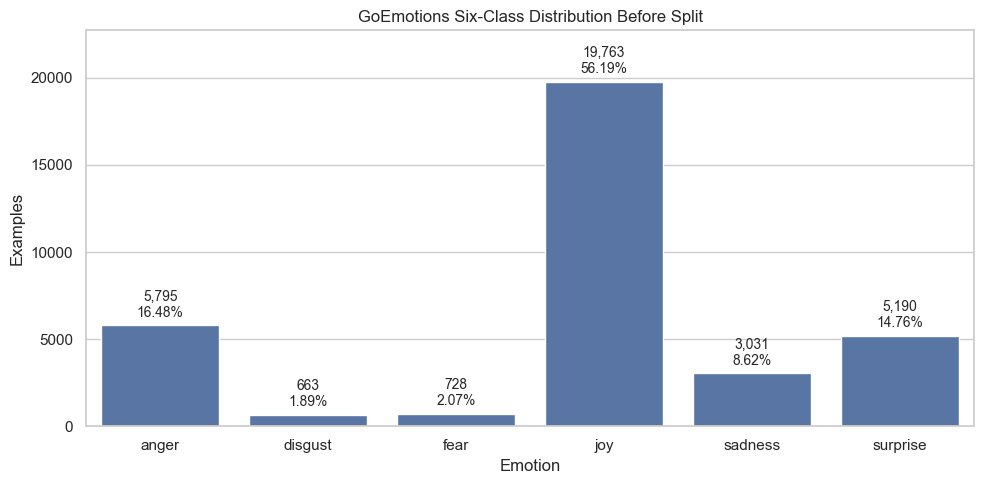
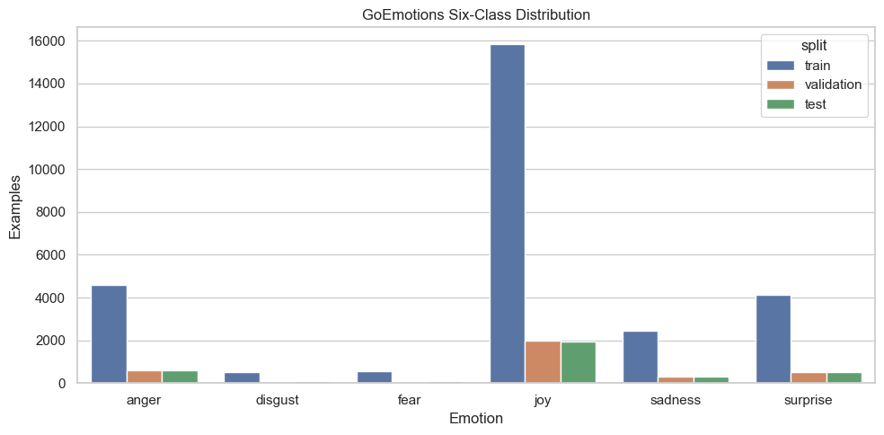
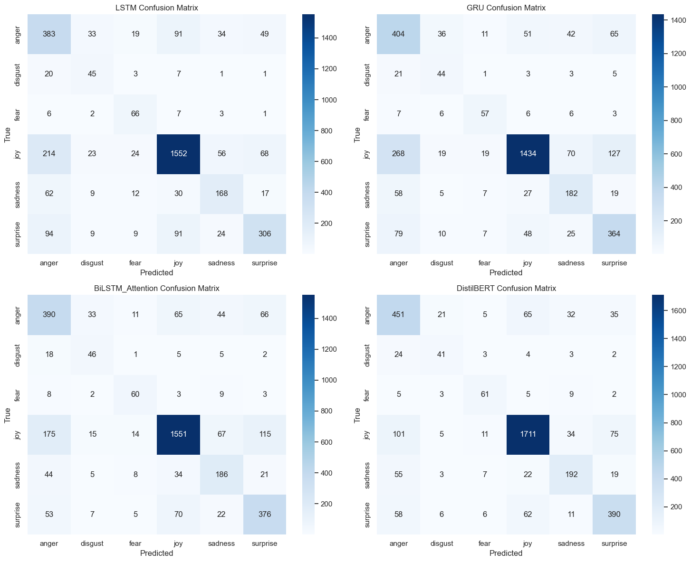
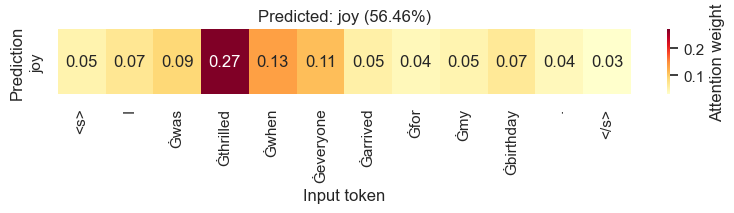
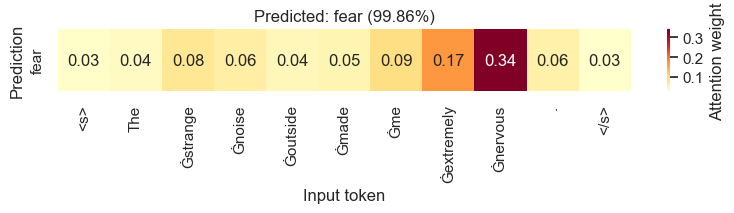
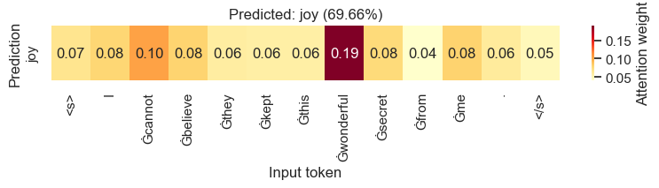

# Emotion Classification System

This project builds and compares four deep-learning models for classifying text
into six emotions:

- Anger
- Disgust
- Fear
- Joy
- Sadness
- Surprise

The notebook follows the same end-to-end structure as the Named Entity
Recognition project: configuration, data loading, exploration, preprocessing,
pre-trained embeddings, custom sequence models, checkpoint saving, transformer
fine-tuning, evaluation, comparison, explainability, and testing on new text.

## Dataset

The project uses the official simplified
[GoEmotions dataset](https://huggingface.co/datasets/google-research-datasets/go_emotions).
It contains Reddit comments annotated with 27 fine-grained emotions or neutral.

The notebook maps those labels to Ekman's six basic emotions using the official
[GoEmotions Ekman mapping](https://github.com/google-research/google-research/blob/master/goemotions/data/ekman_mapping.json):

| Target emotion | Fine-grained GoEmotions labels |
|---|---|
| Anger | anger, annoyance, disapproval |
| Disgust | disgust |
| Fear | fear, nervousness |
| Joy | joy, amusement, approval, excitement, gratitude, love, optimism, relief, pride, admiration, desire, caring |
| Sadness | sadness, disappointment, embarrassment, grief, remorse |
| Surprise | surprise, realization, confusion, curiosity |

This is a single-label classification project. A multi-label comment is retained
when all mapped labels agree on one target emotion. Neutral comments and comments
whose labels map to multiple target emotions are excluded.

The mapped training and validation examples are combined and split again using
label stratification with random seed `42`. Their original sizes are preserved,
and the official test split remains untouched.

The prepared local splits contain:

| Split | Rows |
|---|---:|
| Train | 28,104 |
| Validation | 3,527 |
| Test | 3,539 |

Local data is stored in:

```text
data/goemotions_six/
data/goemotions_six_csv/
data/goemotions_six_stratified_train_validation/
data/goemotions_six_stratified_train_validation_csv/
```

The `goemotions_six_stratified_train_validation` dataset is the active dataset
used for model training and evaluation.

## Notebook Workflow

The notebook is organized as follows:

1. Imports and configuration
2. Load, map, and stratify GoEmotions
3. Dataset exploration and quality checks
4. Tokenize text with BART for the custom sequence models
5. Load pre-trained GloVe embeddings
6. Build LSTM, GRU, and BiLSTM + Attention
7. Train custom models with dynamic rotating undersampling and save checkpoints
8. Plot attention heatmaps
9. Tokenize text for DistilBERT
10. Fine-tune DistilBERT with a dynamic undersampled Hugging Face Trainer
11. Print DistilBERT outputs and classification report
12. Compare models and plot confusion matrices
13. Test the best model on new text
14. Summarize the completed project

## Models

### LSTM

- Pre-trained GloVe 300-dimensional word embeddings
- BART tokenizer vocabulary from `facebook/bart-base`
- Two-layer unidirectional LSTM
- Dynamic rotating undersampling sampler
- Unweighted cross-entropy loss
- Token sequence padding and packed-sequence processing

### GRU

- Pre-trained GloVe 300-dimensional word embeddings
- BART tokenizer vocabulary from `facebook/bart-base`
- Two-layer GRU
- Dynamic rotating undersampling sampler
- Unweighted cross-entropy loss
- Token sequence padding and packed-sequence processing

### BiLSTM + Attention

- Pre-trained GloVe 300-dimensional word embeddings
- BART tokenizer vocabulary from `facebook/bart-base`
- Two-layer bidirectional LSTM
- Learned token-level attention
- Attention heatmaps for prediction interpretation
- Dynamic rotating undersampling sampler
- Unweighted cross-entropy loss

### DistilBERT

- `distilbert-base-uncased`
- Hugging Face `AutoTokenizer`
- Hugging Face `AutoModelForSequenceClassification`
- Hugging Face `Trainer`
- Custom Trainer with the same dynamic rotating undersampler
- Unweighted cross-entropy loss on balanced training epochs

## Imbalance Strategy

Training uses a dynamic rotating undersampler. Each epoch contains the same
number of examples from every class, using the minority-class count as the
per-class target:

```text
samples_per_epoch = minority_class_count * number_of_classes
```

Majority-class examples rotate across epochs instead of being permanently
dropped. Because the training batches come from balanced epochs, the loss is
standard unweighted cross entropy. Validation and test sets are never
undersampled.

## Evaluation

Every model is evaluated using:

- Accuracy
- Macro precision
- Macro recall
- Macro F1
- Per-class precision, recall, and F1
- Six-class confusion matrix

Macro F1 is the primary comparison metric because GoEmotions is strongly
imbalanced after mapping to six classes.

## Test Results

The saved notebook outputs from the previous run produced the following results
on the 3,539-example test split. After switching to dynamic rotating
undersampling, rerun the training cells to refresh these metrics:

| Model | Accuracy | Macro precision | Macro recall | Macro F1 |
|---|---:|---:|---:|---:|
| DistilBERT | **0.7971** | **0.6762** | **0.7096** | **0.6916** |
| BiLSTM + Attention | 0.7256 | 0.5949 | 0.7017 | 0.6350 |
| GRU | 0.7200 | 0.5998 | 0.6802 | 0.6279 |
| LSTM | 0.7073 | 0.5847 | 0.6527 | 0.6101 |

DistilBERT is the best model by both accuracy and macro F1. The notebook also
prints the complete per-class classification report for every model.

For reference, the earlier non-sampled DistilBERT achieved `0.7966` accuracy
and `0.7063` macro F1 on the same official test split.

## Charts

### Dataset Distribution





### Model Comparison



### Attention Heatmaps







## Attention Explainability

The BiLSTM + Attention model returns one attention weight per input token. The
notebook displays those weights as heatmaps so that the most influential words
can be inspected for each prediction.

Attention is an interpretation aid, not a guarantee of causal explanation.

## GloVe

The custom models expect:

```text
embeddings/glove.6B.300d.txt
```

The notebook builds an embedding matrix matching the BART tokenizer vocabulary.
BART subword tokens that normalize to GloVe words receive matching vectors.
Other non-padding tokens receive small random vectors, and the padding vector
remains zero.

## Checkpoints

The notebook saves:

- Best and last custom-model weights
- Custom optimizer states
- DistilBERT model weights
- DistilBERT optimizer and scheduler states
- Training histories
- Label mappings
- Vocabulary
- Hyperparameters
- Stratification and dynamic undersampling settings
- Final comparison results

Checkpoints are written to:

```text
checkpoints/
```

Large model and embedding files are ignored by Git.

## Run

Activate the `subway_rl` environment and install dependencies:

```bash
pip install -r requirements.txt
```

Open:

```text
Emotion Classification.ipynb
```

Run the notebook from top to bottom.

## Source

GoEmotions was introduced by Demszky et al. in:

> GoEmotions: A Dataset of Fine-Grained Emotions, ACL 2020.

The original project and mapping are available in the
[Google Research repository](https://github.com/google-research/google-research/tree/master/goemotions).
